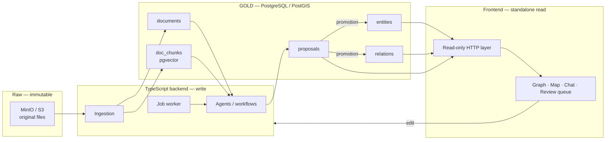

# Gabriel — Technical specification

**Version** 1.1 · 6 August 2026
The contract. The *why* behind each choice is in `decisions.md`, referenced by identifier.
The tables, the constraints and the triggers are in `schema.md`.

## Table of contents

| § | Section | Read it when |
|---|---|---|
| 1 | Overview | You need the shape of the system. |
| 2 | Invariants | Always. These rules hold on every write path. |
| 3 | Schema | Pointer to `schema.md`. |
| 4 | Read path | You add a read, a query or a public surface. |
| 5 | Write path | You add an ingest, an extraction or a promotion path. |
| 6 | What is not specified here | Before you choose a value that no document gives. |

---

## 1. Overview



**Two services in the first build**: PostgreSQL/PostGIS and MinIO (T5).

---

## 2. Invariants

These rules are never violated, whatever the write path. The last column names the tier
that enforces the rule today.

| # | Invariant | Decision | Enforced by |
|---|---|---|---|
| 1 | Every attribute carries at least one source. | M8 | Database — `attrs_valid()`, `schema.md` §6 |
| 2 | Every cited source exists in `documents`. | S2 | Database for `attrs` — `attribute_source` foreign key, §5 and §7. **Application only** for `entities.sources`, `relations.sources` and `proposals.src`. |
| 3 | A machine proposal cites a real document, never `manual`. | M8 | Database — `proposal_src_not_manual`, §9. The existence of the document is checked by the application. |
| 4 | No attribute value is null; the unknown is the absence of a key. | M9 | Database — `attrs_valid()`, §6 |
| 5 | Nothing enters `entities` / `relations` without the explicit promotion of a proposal or a direct operator action. | P1 | **Application only.** No constraint, no trigger. See §6. |
| 6 | Every ADMIRALTY rating carries its origin. | S4 | Database — `doc_admiralty_origin`, §2 |

The acceptance criterion in `prd.md` §7.3 asks for enforcement by constraint or by trigger
for all six. Invariant 5, and the three columns named under invariant 2, do not meet it
yet. §6 records this as open.

---

## 3. Schema

The tables, the columns, the constraints, the triggers, the indexes and the database roles
are in `schema.md`. Read that document only when you touch one of them.

---

## 4. Read path

The frontend reads through a read-only HTTP layer (T4). The `gabriel_read` role, its
allowlist and the `neighbourhood()` traversal function are in `schema.md` §15.

| Guardrail | Effect |
|---|---|
| Read-only role, explicit allowlist of tables, views and functions | No access outside the perimeter |
| `statement_timeout` + default `LIMIT` | Cuts off pathological queries |
| CDN cache on GETs | Absorbs the public load |
| PgBouncer | Prevents connection exhaustion |

Complex read logic — graph traversal above all — lives in a SQL function, not in the
client (T4).

---

## 5. Write path

```
File → S3 (immutable, key returned)
     → documents row (retrieved_at mandatory)
     → extraction job (queued)
     → worker: text extraction → doc_chunks + embeddings
     → agent workflow → proposals (src mandatory, never 'manual')
     → exception rule: dissent OR confidence < threshold
          ├── true  → review queue + graph marker → human decision
          └── false → OPEN, see §6
     → entities / relations (evidentiary layer)
```

**Review by exception (S3).** Send to human review every proposal such that
`dissent = true` OR `confidence < threshold`. The threshold is an operational parameter,
not a code constant.

**What happens to the rest is an open question.** S3 says the operator intervenes only on
dissent or low confidence. P1 and invariant 5 say nothing reaches the evidentiary layer
without explicit promotion. The two cannot both hold. Do not settle this in code and do
not settle it in a document. See §6.

**Applying a proposal**: a single transaction that writes the target, moves the proposal to
`accepted`, and fills in `decided_at` / `decided_by`. A rejection moves it to `rejected`
without writing the target — rejected proposals are never deleted, they are the record of
what was set aside.

**Review surfaces (P3).** The partial index on `target` feeds the markers in the graph
view; the index on `status` feeds the review queue. Both are in `schema.md` §9.

---

## 6. What is not specified here

Each row is an open question. Per `CLAUDE.md`, each one lives as a tracker ticket. Never
settle one by writing code, and never settle one by writing a default value.

| Topic | Status |
|---|---|
| Automatic application of a proposal | **OPEN and blocking.** S3 and P1 conflict. One of the two must be replaced explicitly in `decisions.md`. |
| Enforcement tier for invariant 5, and for the three source arrays of invariant 2 | **OPEN.** `prd.md` §7.3 asks for a constraint or a trigger. Neither exists. |
| Mapping library and tile path | T8 — to be settled before any rendering code |
| Frontend framework | T7 — deferred |
| Migration tool, and the order the DDL is applied in | **OPEN.** No decision entry covers it. |
| Folder layout, test command, check command, definition of done | **OPEN.** No document states them. `gab-coder` and `test-fixer` need them. |
| Detailed shape of `payload` per operation type | To be frozen with the first agent written |
| Confidence threshold | Operational parameter, to be calibrated on the first runs |
| Rendering proposals as ghost elements | Client-side rendering work, no schema impact |
| v1 corpus migration | After validating the model on a sample (C7) |
| Correction and right-of-reply mechanism | Adopted by PU1. Its shape is open, to be settled before first publication. |
