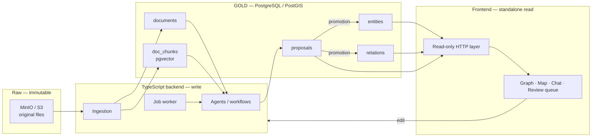

# Gabriel — Technical specification

**Version** 1.2 · 7 August 2026
The contract. The *why* behind each choice is in `decisions.md`, referenced by identifier.
No schema is settled. §3 says what `schema.md` is, and what it is not.

## Table of contents

| § | Section | Read it when |
|---|---|---|
| 1 | Overview | You need the shape of the system. |
| 2 | Invariants | Always. These rules hold on every write path. |
| 3 | Schema | You need to know what is decided about the database. Nothing is. |
| 4 | Read path | You add a read, a query or a public surface. |
| 5 | Write path | You add an ingest, an extraction or a promotion path. |
| 6 | What is not specified here | Before you choose a value that no document gives. |

---

## 1. Overview



**Two services in the first build**: PostgreSQL/PostGIS and MinIO (T5).

---

## 2. Invariants

These rules are never violated, whatever the write path.

**No tier enforces any of them today.** No database exists and no code exists. The last
column names the tier that must carry each rule when the build reaches it. It is a
requirement, not a report.

| # | Invariant | Decision | Tier that must carry it |
|---|---|---|---|
| 1 | Every attribute carries at least one source. | M8 | Database. A check on the shape of the attribute object. |
| 2 | Every cited source exists in `documents`. | S2 | Database for `attrs`, through a foreign key. **Undecided** for `entities.sources`, `relations.sources` and `proposals.src`. See §6. |
| 3 | A machine proposal cites a real document, never `manual`. | M8 | Database for the value. The application checks that the document exists. |
| 4 | No attribute value is null; the unknown is the absence of a key. | M9 | Database. The same check as invariant 1. |
| 5 | Nothing enters `entities` / `relations` without the explicit promotion of a proposal or a direct operator action. | P1 | **Undecided.** No tier is named. See §6. |
| 6 | Every ADMIRALTY rating carries its origin. | S4 | Database. A check that ties the rating to its origin. |

`schema.md` §6, §9 and §2 illustrate one way to build the checks above. That document is
provisional and it decides nothing. Do not cite it as the authority for an invariant.

The acceptance criterion in `prd.md` §7.3 asks for enforcement by a constraint or by a
trigger for all six. **None is met today, because nothing is built.** Invariant 5, and the
three columns named under invariant 2, are further behind: no tier is named for them at
all. §6 records both as open.

---

## 3. Schema

**No schema is settled.** `schema.md` shows one possible shape, produced during the
requirements grilling. It is an example. It is not part of this contract, and no line of it
is decided.

The real schema is written in the migration files, when the build needs it. It must satisfy
§2 above. Read `schema.md` for an illustration of how an invariant can map to a table, a
constraint or a trigger — never as an authority.

---

## 4. Read path

The frontend reads through a read-only HTTP layer (T4). The read path needs a read-only
database role, an explicit allowlist, and a graph traversal that runs inside the database.

**ADR 0003 settles the allowlist.** The role `gabriel_read` gets nothing on `public` — not
even `USAGE`. It gets `USAGE` on the `api` schema, `SELECT` on the views in it and `EXECUTE`
on the functions in it, and nothing else. One view per concept, not per surface. `schema.md`
§15 illustrates a grant on base tables; that illustration is superseded.

| Guardrail | Effect |
|---|---|
| Read-only role, explicit allowlist of the views and functions of `api` | No access outside the perimeter |
| `statement_timeout` + default `LIMIT` | Cuts off pathological queries |
| CDN cache on GETs | Absorbs the public load |
| PgBouncer | Prevents connection exhaustion |

Complex read logic — graph traversal above all — lives in a SQL function, not in the
client (T4).

---

## 5. Write path

**One door (P6).** Every file enters through `put_document`, which writes the object, writes
the `documents` row and queues the work. Two paths run behind it. A file written straight
into the bucket has no row, so it is invisible to search, to the agents and to the UI.

```
put_document
     → S3 (immutable, key returned)
     → documents row (retrieved_at mandatory)
     → job (queued)
     ├── text path (P5)
     │    → worker: text extraction → doc_chunks + embeddings
     │    → agent workflow → proposals (src mandatory, never 'manual')
     └── structured path (P6)
          → agent reads the file schema and a sample
          → mapping proposal → promotion → bulk load in code

every proposal, from either path
     → exception rule: dissent OR confidence < threshold
          ├── true  → review queue + graph marker → human decision
          └── false → OPEN, see §6
     → entities / relations (evidentiary layer)
```

**Review by exception (S3).** Send to human review every proposal such that
`dissent = true` OR `confidence < threshold`. The threshold is an operational parameter,
not a code constant.

**What happens to the rest is an open question.** S3 says the operator intervenes only on
dissent or low confidence. P1 and invariant 5 say nothing reaches the evidentiary layer
without explicit promotion. The two cannot both hold. Do not settle this in code and do
not settle it in a document. See §6.

**Applying a proposal**: a single transaction that writes the target, moves the proposal to
`accepted`, and fills in `decided_at` / `decided_by`. A rejection moves it to `rejected`
without writing the target — rejected proposals are never deleted, they are the record of
what was set aside.

**Review surfaces (P3).** Two reads must stay cheap: the pending proposals attached to one
graph element, and the full review queue. Each one needs its own index. `schema.md` §9
illustrates a pair; it settles neither.

---

## 6. What is not specified here

Each row is an open question. Per `CLAUDE.md`, each one lives as a tracker ticket. Never
settle one by writing code, and never settle one by writing a default value.

| Topic | Status |
|---|---|
| Automatic application of a proposal | **OPEN and blocking.** S3 and P1 conflict. One of the two must be replaced explicitly in `decisions.md`. |
| Enforcement tier for invariant 5, and for the three source arrays of invariant 2 | **OPEN** — #15. `prd.md` §7.3 asks for a constraint or a trigger. Neither exists. The roles of ADR 0003 hold an agent back; they do not enforce invariant 5. |
| Mapping library and tile path | **Settled** by ADR 0005, which replaces T8. #4 closed. |
| Frontend framework, and the shape of the frontend | **Settled** by ADR 0004, which replaces T7. #5 closed. |
| The read HTTP layer | **Settled** by ADR 0003 v2: PostgREST. #6 closed. |
| The two reads that return everything | **OPEN** — #37. The full-graph read and the full map read cannot carry the default `LIMIT` below. ADR 0003 v2 §9 records the exemption; the mechanism is open. |
| Where view state lives | **A proposal, for review** — #33. The URL holds identity, `localStorage` holds the workspace, and a value lives in exactly one of the two. There is no permalink requirement. |
| Graph layout positions | **OPEN** — #35. A browser force layout is not deterministic, so positions are precomputed and stored. No schema holds them. |
| Migration tool, and the order the DDL is applied in | **Settled** by ADR 0003. #22 closed. |
| What the read-only role selects from: base tables, or views and functions | **Settled** by ADR 0003: views and functions in an `api` schema, never a base table. #23 closed. |
| Which generator produces the TypeScript types from the schema | **OPEN** — #26. ADR 0003 requires generation; it names no tool, because `geometry` and `vector` break naive ones. |
| The LLM stack: provider, model per agent, spend ceiling, failure behaviour | **OPEN** — #25. The ticket records a provider preference. **No entry in `decisions.md` and no ADR settles it**, so nothing here is locked. Parked until the UI exists. |
| How a reader reaches a source file | **Settled** by #31, closed. The bucket stays private. The UI links the original source URL, plus a web-archive URL and the file hash recorded at ingest. PU1 governs the claims, not the bytes; that reading lives on #31 and is not a locked entry. |
| Whether the raw store stays on MinIO | **OPEN** — #32. Both MinIO repositories are archived, so no release is expected. The image is pinned, so nothing changes without a commit. |
| Proving that the raw bucket and the `documents` index agree | **OPEN** — #27. P6 gives one door; this is the alarm for when the door is bypassed. |
| Withdrawing a document, and the manual deletion exception | **OPEN** — #28. The ticket proposes soft withdrawal, which leaves T3 standing. Overlaps #11. |
| The payload of a structured-file mapping proposal | **OPEN** — #29. Created by the replacement of P6. Overlaps #7. |
| Folder layout, package manager, check command | **Settled** by ADR 0001. |
| How PostgreSQL and the object store run locally | **Settled** by ADR 0002. |
| Test command, and the runner behind it | **Settled** by ADR 0001 v3: Vitest. #24 closed. What must be tested stays **OPEN** — #21. |
| A deployment, and authenticated editors | **OPEN and locked against** — #34. The operator intends a public read surface with authenticated editing later. It contradicts **C5** and `prd.md` §2, so no code anticipates it. |
| Definition of done | Settled by ADR 0001, except the test requirement, which is **OPEN** — #21. |
| Detailed shape of `payload` per operation type | To be frozen with the first agent written |
| Confidence threshold | Operational parameter, to be calibrated on the first runs |
| Rendering proposals as ghost elements | Client-side rendering work, no schema impact |
| v1 corpus migration | After validating the model on a sample (C7) |
| Correction and right-of-reply mechanism | Adopted by PU1. Its shape is open, to be settled before first publication. |
