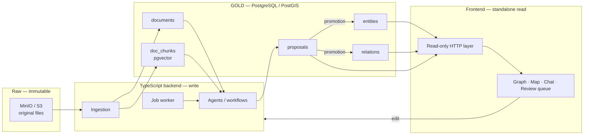

# Gabriel — Technical specification

**Version** 1.0 · 6 August 2026
Implementation document. The *why* behind each choice is in `decisions.md`, referenced by identifier.

---

## 1. Overview



**Two services in the first build**: PostgreSQL/PostGIS and MinIO (T5).

---

## 2. Invariants

These rules are never violated, whatever the write path.

1. Every attribute carries at least one source (M8).
2. Every cited source exists in `documents` (S2).
3. A machine proposal cites a real document, never `manual` (M8).
4. No attribute value is null; the unknown is the absence of a key (M9).
5. Nothing enters the `entities` / `relations` tables without the explicit promotion of a proposal or a direct operator action (P1).
6. Every ADMIRALTY rating carries its origin (S4).

---

## 3. Schema

### 3.1 Extensions

```sql
CREATE EXTENSION IF NOT EXISTS postgis;
CREATE EXTENSION IF NOT EXISTS vector;
CREATE EXTENSION IF NOT EXISTS pg_trgm;   -- fuzzy search on labels
```

### 3.2 Documents

```sql
CREATE TABLE documents (
  id                text PRIMARY KEY,           -- 'doc_8f2a', 'manual'
  kind              text NOT NULL
                    CHECK (kind IN ('file','url','api','report','manual')),
  s3_key            text,                       -- immutable raw; NULL if purely external
  uri               text,                       -- original URL
  title             text NOT NULL,
  mime              text,
  retrieved_at      date,                       -- date retrieved (M6)
  admiralty         char(2)
                    CHECK (admiralty ~ '^[A-F][1-6]$'),
  admiralty_origin  text
                    CHECK (admiralty_origin IN ('machine','arbitrated','human')),
  created_at        timestamptz NOT NULL DEFAULT now(),

  -- a consultable source must carry the date it was retrieved
  CONSTRAINT doc_retrieved_required
    CHECK (kind = 'manual' OR retrieved_at IS NOT NULL),
  -- a rating without an origin is forbidden
  CONSTRAINT doc_admiralty_origin
    CHECK ((admiralty IS NULL) = (admiralty_origin IS NULL))
);

INSERT INTO documents (id, kind, title)
VALUES ('manual', 'manual', 'Direct human entry');
```

`manual` is a document like any other: rateable, queryable, and it makes it possible to list everything that rests on the operator's authority alone.

### 3.3 Entities

```sql
CREATE TABLE entities (
  id          uuid PRIMARY KEY DEFAULT gen_random_uuid(),
  type        text NOT NULL,
  label       text NOT NULL,
  geom        geometry(Geometry, 4326),
  attrs       jsonb NOT NULL DEFAULT '{}'::jsonb
              CHECK (attrs_valid(attrs)),
  sources     text[] NOT NULL DEFAULT '{}',     -- entity-level list (S2)
  created_at  timestamptz NOT NULL DEFAULT now(),
  updated_at  timestamptz NOT NULL DEFAULT now()
);

CREATE INDEX entities_geom_gix  ON entities USING gist (geom);
CREATE INDEX entities_attrs_gin ON entities USING gin (attrs jsonb_path_ops);
CREATE INDEX entities_type_idx  ON entities (type);
CREATE INDEX entities_label_trgm ON entities USING gin (label gin_trgm_ops);
```

`geometry(Geometry, 4326)` accepts point, line and polygon in the same column — necessary since sites, footprints and tracks coexist.

### 3.4 Relations

```sql
CREATE TABLE relations (
  id          uuid PRIMARY KEY DEFAULT gen_random_uuid(),
  type        text NOT NULL,
  src_kind    text NOT NULL DEFAULT 'entity'
              CHECK (src_kind IN ('entity','relation')),
  src_id      uuid NOT NULL,
  dst_kind    text NOT NULL DEFAULT 'entity'
              CHECK (dst_kind IN ('entity','relation')),
  dst_id      uuid NOT NULL,
  valid_from  date,
  valid_to    date,
  attrs       jsonb NOT NULL DEFAULT '{}'::jsonb
              CHECK (attrs_valid(attrs)),
  sources     text[] NOT NULL DEFAULT '{}',
  created_at  timestamptz NOT NULL DEFAULT now(),
  updated_at  timestamptz NOT NULL DEFAULT now(),

  -- intervals reserved for identity and ownership relations (M6)
  CONSTRAINT rel_dates_scope CHECK (
    (valid_from IS NULL AND valid_to IS NULL)
    OR type IN ('owns','operates','flags','insures','appoints')
  ),
  CONSTRAINT rel_dates_order CHECK (
    valid_from IS NULL OR valid_to IS NULL OR valid_from <= valid_to
  )
);

CREATE INDEX relations_src_idx ON relations (src_kind, src_id);
CREATE INDEX relations_dst_idx ON relations (dst_kind, dst_id);
CREATE INDEX relations_type_idx ON relations (type);
```

**Caveat (M4)**: `src_id` and `dst_id` cannot carry a foreign key, since the target is polymorphic. Integrity goes through the `check_relation_endpoints` trigger in 3.7. That is the explicit price of deferred reification.

### 3.5 Attribute provenance mirror

```sql
CREATE TABLE attribute_source (
  owner_kind text NOT NULL CHECK (owner_kind IN ('entity','relation')),
  owner_id   uuid NOT NULL,
  attr_key   text NOT NULL,
  doc_id     text NOT NULL REFERENCES documents(id) ON DELETE RESTRICT,
  PRIMARY KEY (owner_kind, owner_id, attr_key, doc_id)
);

CREATE INDEX attribute_source_doc_idx ON attribute_source (doc_id);
```

This table is **maintained by trigger**, never written by hand. It provides three things that JSONB alone cannot:

- a real foreign key, and therefore the impossibility of deleting a document that is still cited;
- the reverse direction — "which attributes cite this document?" — which is the central mechanism when an ADMIRALTY rating changes at the document level (S1): the score moves, and the table says exactly which claims are affected;
- a usable index, where scanning the JSONB of every row is not.

### 3.6 JSONB validation

```sql
CREATE OR REPLACE FUNCTION attrs_valid(a jsonb)
RETURNS boolean LANGUAGE sql IMMUTABLE AS $$
  SELECT NOT EXISTS (
    SELECT 1
    FROM jsonb_each(a) AS e(k, val)
    WHERE
      -- the attribute is an object
      jsonb_typeof(val) <> 'object'
      -- exactly the keys v and src
      OR NOT (val ? 'v') OR NOT (val ? 'src')
      OR (SELECT count(*) FROM jsonb_object_keys(val) ok
           WHERE ok NOT IN ('v','src')) > 0
      -- value never null, never nested (M7, M9)
      OR jsonb_typeof(val->'v') IN ('null','object')
      OR (jsonb_typeof(val->'v') = 'array' AND EXISTS (
            SELECT 1 FROM jsonb_array_elements(val->'v') x
            WHERE jsonb_typeof(x) IN ('object','array','null')))
      -- src: array of strings, never empty (M8)
      OR jsonb_typeof(val->'src') <> 'array'
      OR jsonb_array_length(val->'src') = 0
      OR EXISTS (SELECT 1 FROM jsonb_array_elements(val->'src') s
                  WHERE jsonb_typeof(s) <> 'string')
  );
$$;
```

Written in plain SQL rather than with `pg_jsonschema`, which is not available on every distribution. It expresses exactly M7, M8 and M9, and remains usable inside a `CHECK`.

**Expected shape:**

```json
{
  "coal_stock_t": { "v": 240000,      "src": ["doc_8f2a"] },
  "roof_colour":  { "v": "blue",      "src": ["doc_3c11", "doc_9b04"] },
  "known_flags":  { "v": ["PA","MN"], "src": ["manual"] }
}
```

### 3.7 Triggers

```sql
-- Provenance mirror synchronisation
CREATE OR REPLACE FUNCTION sync_attribute_source()
RETURNS trigger LANGUAGE plpgsql AS $$
BEGIN
  DELETE FROM attribute_source
   WHERE owner_kind = TG_ARGV[0]::text AND owner_id = NEW.id;

  INSERT INTO attribute_source (owner_kind, owner_id, attr_key, doc_id)
  SELECT TG_ARGV[0]::text, NEW.id, e.k, s.doc
    FROM jsonb_each(NEW.attrs) AS e(k, val),
         LATERAL jsonb_array_elements_text(val->'src') AS s(doc)
  ON CONFLICT DO NOTHING;

  RETURN NEW;
END $$;

CREATE TRIGGER entities_attr_src
  AFTER INSERT OR UPDATE OF attrs ON entities
  FOR EACH ROW EXECUTE FUNCTION sync_attribute_source('entity');

CREATE TRIGGER relations_attr_src
  AFTER INSERT OR UPDATE OF attrs ON relations
  FOR EACH ROW EXECUTE FUNCTION sync_attribute_source('relation');

-- Mirror cleanup on delete
CREATE OR REPLACE FUNCTION clean_attribute_source()
RETURNS trigger LANGUAGE plpgsql AS $$
BEGIN
  DELETE FROM attribute_source
   WHERE owner_kind = TG_ARGV[0]::text AND owner_id = OLD.id;
  RETURN OLD;
END $$;

CREATE TRIGGER entities_attr_src_del
  AFTER DELETE ON entities
  FOR EACH ROW EXECUTE FUNCTION clean_attribute_source('entity');

CREATE TRIGGER relations_attr_src_del
  AFTER DELETE ON relations
  FOR EACH ROW EXECUTE FUNCTION clean_attribute_source('relation');

-- Polymorphic endpoint integrity (M4)
CREATE OR REPLACE FUNCTION check_relation_endpoints()
RETURNS trigger LANGUAGE plpgsql AS $$
BEGIN
  IF NEW.src_kind = 'entity' THEN
    PERFORM 1 FROM entities WHERE id = NEW.src_id;
  ELSE
    PERFORM 1 FROM relations WHERE id = NEW.src_id;
  END IF;
  IF NOT FOUND THEN
    RAISE EXCEPTION 'src % (%) not found', NEW.src_id, NEW.src_kind;
  END IF;

  IF NEW.dst_kind = 'entity' THEN
    PERFORM 1 FROM entities WHERE id = NEW.dst_id;
  ELSE
    PERFORM 1 FROM relations WHERE id = NEW.dst_id;
  END IF;
  IF NOT FOUND THEN
    RAISE EXCEPTION 'dst % (%) not found', NEW.dst_id, NEW.dst_kind;
  END IF;

  RETURN NEW;
END $$;

CREATE TRIGGER relations_endpoints
  BEFORE INSERT OR UPDATE OF src_id, dst_id, src_kind, dst_kind ON relations
  FOR EACH ROW EXECUTE FUNCTION check_relation_endpoints();
```

### 3.8 Merge and reversibility (M12)

```sql
CREATE TABLE entity_alias (
  alias_id     uuid PRIMARY KEY,                       -- historical identifier
  canonical_id uuid NOT NULL REFERENCES entities(id) ON DELETE RESTRICT,
  created_at   timestamptz NOT NULL DEFAULT now()
);

CREATE TABLE merge_log (
  id           bigserial PRIMARY KEY,
  canonical_id uuid NOT NULL,
  merged_id    uuid NOT NULL,
  snapshot     jsonb NOT NULL,        -- absorbed entity + its relations, in full
  decided_by   text NOT NULL,         -- 'human' | 'agent:<name>'
  score        numeric,
  created_at   timestamptz NOT NULL DEFAULT now()
);
```

`snapshot` must contain the entity **and its relations** at the moment of the merge. Without the relations, undoing restores nothing but an isolated node.

### 3.9 Proposals (P2, P4)

```sql
CREATE TABLE proposals (
  id           uuid PRIMARY KEY DEFAULT gen_random_uuid(),
  op           text NOT NULL CHECK (op IN (
                 'create_entity','update_attrs','delete_entity',
                 'create_relation','update_relation','delete_relation',
                 'merge_entities')),
  target_kind  text CHECK (target_kind IN ('entity','relation')),
  target_id    uuid,                       -- NULL for a creation
  payload      jsonb NOT NULL,             -- shape depends on op
  src          text[] NOT NULL,            -- cited documents
  confidence   numeric NOT NULL CHECK (confidence BETWEEN 0 AND 1),
  agent        text NOT NULL,
  votes        jsonb,                      -- diverging agent opinions
  dissent      boolean NOT NULL DEFAULT false,
  run_id       uuid,
  status       text NOT NULL DEFAULT 'pending'
               CHECK (status IN ('pending','accepted','rejected','superseded')),
  created_at   timestamptz NOT NULL DEFAULT now(),
  decided_at   timestamptz,
  decided_by   text,

  -- a machine proposal cannot source itself (M8)
  CONSTRAINT proposal_src_not_manual
    CHECK (NOT ('manual' = ANY(src)) AND array_length(src, 1) >= 1)
);

CREATE INDEX proposals_pending_idx
  ON proposals (status, created_at) WHERE status = 'pending';
CREATE INDEX proposals_target_idx
  ON proposals (target_kind, target_id) WHERE status = 'pending';
```

The partial index on `target` feeds the markers in the graph view (P3); the index on `status` feeds the review queue.

**Review-by-exception rule (S3)**: send to human review every proposal such that `dissent = true` OR `confidence < threshold`. The rest are applied automatically. The threshold is an operational parameter, not a code constant.

### 3.10 Agents, workflows, runs

```sql
CREATE TABLE agents (
  id       uuid PRIMARY KEY DEFAULT gen_random_uuid(),
  name     text NOT NULL UNIQUE,
  role     text NOT NULL,            -- extractor | scorer | critic | resolver
  model    text NOT NULL,
  prompt   text NOT NULL,
  params   jsonb NOT NULL DEFAULT '{}'::jsonb,
  version  int  NOT NULL DEFAULT 1,
  active   boolean NOT NULL DEFAULT true
);

CREATE TABLE workflows (
  id     uuid PRIMARY KEY DEFAULT gen_random_uuid(),
  name   text NOT NULL UNIQUE,
  steps  jsonb NOT NULL             -- ordered sequence of agent references
);

CREATE TABLE workflow_runs (
  id          uuid PRIMARY KEY DEFAULT gen_random_uuid(),
  workflow_id uuid NOT NULL REFERENCES workflows(id),
  input       jsonb NOT NULL,
  status      text NOT NULL DEFAULT 'running'
              CHECK (status IN ('running','done','failed')),
  error       text,
  started_at  timestamptz NOT NULL DEFAULT now(),
  ended_at    timestamptz
);
```

Versioning the agents is indispensable: when a proposal is judged bad, one has to be able to tell which version of the prompt produced it.

### 3.11 Vector index (T5)

```sql
CREATE TABLE doc_chunks (
  id        bigserial PRIMARY KEY,
  doc_id    text NOT NULL REFERENCES documents(id) ON DELETE CASCADE,
  ord       int  NOT NULL,
  content   text NOT NULL,
  embedding vector(1536),
  UNIQUE (doc_id, ord)
);

CREATE INDEX doc_chunks_hnsw
  ON doc_chunks USING hnsw (embedding vector_cosine_ops);
```

### 3.12 Job queue (T5, replaces NATS)

```sql
CREATE TABLE jobs (
  id         bigserial PRIMARY KEY,
  kind       text NOT NULL,
  payload    jsonb NOT NULL,
  status     text NOT NULL DEFAULT 'queued'
             CHECK (status IN ('queued','running','done','failed')),
  attempts   int  NOT NULL DEFAULT 0,
  last_error text,
  run_after  timestamptz NOT NULL DEFAULT now(),
  locked_by  text,
  locked_at  timestamptz,
  created_at timestamptz NOT NULL DEFAULT now()
);

CREATE INDEX jobs_ready_idx ON jobs (run_after)
  WHERE status = 'queued';
```

Claiming a task:

```sql
UPDATE jobs SET status='running', locked_by=$1, locked_at=now(), attempts=attempts+1
WHERE id = (
  SELECT id FROM jobs
   WHERE status='queued' AND run_after <= now()
   ORDER BY run_after
   FOR UPDATE SKIP LOCKED
   LIMIT 1)
RETURNING *;
```

`FOR UPDATE SKIP LOCKED` gives a correct concurrent queue with no extra service.

### 3.13 Map layers

```sql
CREATE TABLE layers (
  id         uuid PRIMARY KEY DEFAULT gen_random_uuid(),
  name       text NOT NULL,
  kind       text NOT NULL CHECK (kind IN ('query','drawn')),
  definition jsonb NOT NULL,   -- filter over entities, or drawn geometries
  style      jsonb NOT NULL DEFAULT '{}'::jsonb,
  visible    boolean NOT NULL DEFAULT true,
  ord        int NOT NULL DEFAULT 0
);
```

A **provisional** structure: it will be revised once the mapping library is settled (T8).

### 3.14 Key drift monitoring (M11)

```sql
CREATE VIEW attr_keys_by_type AS
SELECT e.type, k AS attr_key, count(*) AS n
FROM entities e, jsonb_object_keys(e.attrs) k
GROUP BY 1, 2
ORDER BY 1, 3 DESC;
```

To be reread periodically. The low-occurrence keys are the typos and the semantic duplicates. This view makes things visible; it does not prevent them.

---

## 4. Read path

The frontend reads through a read-only HTTP layer (T4).

**Minimum configuration to put in place on day one:**

```sql
CREATE ROLE gabriel_read NOLOGIN;
GRANT USAGE ON SCHEMA public TO gabriel_read;
-- explicit allowlist, no global GRANT
GRANT SELECT ON entities, relations, documents, proposals, layers TO gabriel_read;
ALTER ROLE gabriel_read SET statement_timeout = '5s';
```

| Guardrail | Effect |
|---|---|
| Read-only role, allowlist of views and functions | No access to tables outside the perimeter |
| `statement_timeout` + default `LIMIT` | Cuts off pathological queries |
| CDN cache on GETs | Absorbs the public load |
| PgBouncer | Prevents connection exhaustion |

**Graph traversal** — exposed as a SQL function, not rebuilt client-side:

```sql
CREATE OR REPLACE FUNCTION neighbourhood(root uuid, depth int DEFAULT 2)
RETURNS TABLE (entity_id uuid, hop int)
LANGUAGE sql STABLE AS $$
  WITH RECURSIVE walk(entity_id, hop) AS (
    SELECT root, 0
    UNION
    SELECT CASE WHEN r.src_id = w.entity_id THEN r.dst_id ELSE r.src_id END, w.hop + 1
      FROM walk w
      JOIN relations r
        ON (r.src_id = w.entity_id AND r.src_kind = 'entity')
        OR (r.dst_id = w.entity_id AND r.dst_kind = 'entity')
     WHERE w.hop < depth
  )
  SELECT entity_id, min(hop) FROM walk GROUP BY entity_id;
$$;
```

---

## 5. Write path

```
File → S3 (immutable, key returned)
     → documents row (retrieved_at mandatory)
     → extraction job (queued)
     → worker: text extraction → doc_chunks + embeddings
     → agent workflow → proposals (src mandatory, never 'manual')
     → exception rule: dissent OR confidence < threshold
          ├── true  → review queue + graph marker → human decision
          └── false → automatic application
     → entities / relations (evidentiary layer)
```

**Applying a proposal**: a single transaction that writes the target, moves the proposal to `accepted`, and fills in `decided_at` / `decided_by`. A rejection moves it to `rejected` without writing the target — rejected proposals are never deleted, they are the record of what was set aside.

---

## 6. What is not specified here

| Topic | Status |
|---|---|
| Mapping library and tile path | T8 — to be settled before any rendering code |
| Frontend framework | T7 — deferred |
| Detailed shape of `payload` per operation type | To be frozen with the first agent written |
| Confidence threshold | Operational parameter, to be calibrated on the first runs |
| Rendering proposals as ghost elements | Client-side rendering work, no schema impact |
| v1 corpus migration | After validating the model on a sample (C7) |
| Correction and right-of-reply mechanism | T9 — required by PU1, to be settled before first publication |
