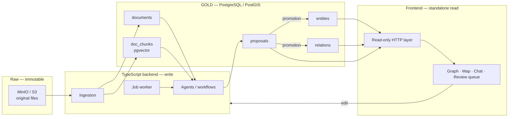

# Gabriel — Technical specification

**Version** 1.5 · 24 August 2026
The contract. The *why* behind each choice is in `decisions.md`, referenced by identifier.
This document decides no table and no column. §3 says where the schema lives.

## Table of contents

| § | Section | Read it when |
|---|---|---|
| 1 | Overview | You need the shape of the system. |
| 2 | Invariants | Always. These rules hold on every write path. |
| 3 | Schema | You need to know where the schema lives. |
| 4 | Read path | You add a read, a query or a public surface. |
| 5 | Write path | You add an ingest, an extraction or a promotion path. |
| 6 | What is not specified here | Before you choose a value that no document gives. |

---

## 1. Overview



**Two services in the first build**: PostgreSQL/PostGIS and MinIO (T5).

---

## 2. Invariants

These rules are never violated, whatever the write path.

**The last column is a requirement, and never a report.** It names the tier that must carry
each rule when the build reaches it.

| # | Invariant | Decision | Tier that must carry it |
|---|---|---|---|
| 1 | Every attribute carries at least one source. | M8 | Database. A check on the shape of the attribute object. |
| 2 | Every cited source exists in `documents`. | S2 | Database. A list of sources carries no foreign key, so a guard proves each source named by an act, and a check holds the sources of a value inside that list. Invariant 5 then carries the guarantee into the evidentiary layer. |
| 3 | A machine never signs an act as `manual`. `manual` is reserved to the human operator. | M8 | Database, by a privilege boundary and a stamp. `gabriel_agent` holds `EXECUTE` on no door that signs. A trigger stamps `author_role` from `session_user`, so the caller cannot state it. A check then refuses `manual` in the act. A value cannot hide one, because every source a value cites must also stand in the act. |
| 4 | No attribute value is null; the unknown is the absence of a key. | M9 | Database. The same check as invariant 1. |
| 5 | Nothing enters `entities` / `relations` without the explicit promotion of a proposal. | P1 | Database, by a privilege boundary. No role writes those tables; a `SECURITY DEFINER` function does. |
| 6 | Every ADMIRALTY rating carries its origin. | S4 | Database. A check that ties the rating to its origin. |

The objects that carry these rules live in `db/migrations/` and `db/apply/`. **Read the SQL for
the authority on a constraint, and never a document.**

The acceptance criterion in `prd.md` §7.3 asks for enforcement by the database, and it asks
that of every invariant above. Invariants 2, 3 and 5 name the third tier that criterion
allows: a **privilege boundary the writing role cannot cross**, held by ADR 0003 §7.

**Invariant 2 has no foreign key, and it cannot have one.** A source is cited in a list and
inside a JSON document, and PostgreSQL constrains neither. The guarantee is made at the door
instead. It holds only while that door stays the one way in, which is invariant 5.

**Invariant 3 is a rule about the signature, and not about the source.** Earlier versions of
this row read "a machine proposal cites a real document, never `manual`". M8 is not narrowed:
a machine still cites a real document, because `manual` is refused in the act and in a value,
and `documents` is read on every proposal. What the row now names is the thing the database
holds — a machine cannot sign as the operator. **`decided_by` is not in this invariant.** A
decision signed by a name that nothing proves to be a person is an open question, and the
tracker carries it. The grants file states that limit in full.

**Invariant 5 names one door, not two.** Earlier versions of this row read "or a direct
operator action". P1 in `decisions.md` carries no such clause, and `prd.md` §4.3 agrees with
the register: the analyst writes the evidentiary layer **by promotion**. An operator edit is
an operator-authored proposal, promoted by the same path. The tracker carries the measurement
behind this, and the six forgeries that decided it.

---

## 3. Schema

**The schema is written in the migration files, and nowhere else.** ADR 0003 §1 makes the
`.sql` files the only source of truth. A migration is written when the build needs it, and it
must satisfy §2 above.

ADR 0003 §3 names the two kinds of file and the rule that separates them. **No document draws
the schema.** A second drawing of a `CREATE TABLE` drifts from the first, so this document holds
the rules and the `.sql` files hold the shape.

---

## 4. Read path

The frontend reads through a read-only HTTP layer (T4). The read path needs a read-only
database role, an explicit allowlist, and a graph traversal that runs inside the database.

**ADR 0003 §6 settles the allowlist, and this document does not repeat it.** The read role
reaches one schema, and it reaches the base tables through nothing.

Four guardrails hold the public read surface, and each one answers a different failure: the
allowlist bounds the perimeter, a statement timeout and a default limit cut off a pathological
query, a cache absorbs the public load, and a connection pooler prevents exhaustion. **The tool
that fills each role is a reversible choice, and a configuration file holds it.**

Complex read logic — graph traversal above all — lives in a SQL function, not in the
client (T4).

---

## 5. Write path

**One door (P6).** Every file enters through `put_document`, which writes the object, writes
the `documents` row and queues the work. Two paths run behind it. A file written straight
into the bucket has no row, so it is invisible to search, to the agents and to the UI.

```
put_document
     → S3 (immutable, key returned)
     → documents row (retrieved_at mandatory)
     → job (queued)
     ├── text path (P5)
     │    → worker: text extraction → doc_chunks + embeddings
     │    → agent workflow → proposals (src mandatory, never 'manual')
     └── structured path (P6)
          → agent reads the file schema and a sample
          → mapping proposal → promotion → bulk load in code

every proposal, from either path
     → exception rule: dissent OR confidence < threshold
          ├── true  → review queue + graph marker → human decision
          └── false → OPEN, see §6
     → entities / relations (evidentiary layer)
```

**Review by exception (S3).** Send to human review every proposal such that
`dissent = true` OR `confidence < threshold`. The threshold is an operational parameter,
not a code constant.

**What happens to the rest is an open question, and the tracker carries it.** S3 says the
operator intervenes only on dissent or low confidence. P1 and invariant 5 say nothing reaches
the evidentiary layer without explicit promotion. The two cannot both hold. Do not settle this
in code and do not settle it in a document. See §6.

**One door in, and it is a function.** Nothing writes `entities` or `relations` directly. The
promotion runs inside a function, which holds the privilege alone. It refuses a proposal that
is not `accepted` with `decided_at` and `decided_by` set. Each evidentiary row carries the
identifier of the proposal that made it, `NOT NULL UNIQUE`, so one proposal makes one row.
**ADR 0003 §7 holds the mechanism and the roles**, and this paragraph does not repeat it.

**Applying a proposal**: a single transaction that writes the target, moves the proposal to
`accepted`, and fills in `decided_at` / `decided_by`. A rejection moves it to `rejected`
without writing the target — rejected proposals are never deleted, they are the record of
what was set aside.

**Review surfaces (P3).** Two reads must stay cheap: the pending proposals attached to one
graph element, and the full review queue. Each one needs its own index.

---

## 6. What is not specified here

**Every open question lives on the tracker, as a ticket, and no list of them is kept in this
document.** A copy of the tracker inside a document goes stale on the day a ticket closes, and
the reader then holds two answers to one question.

Three rules follow, and each one is a defect if it is broken.

- **Never settle an open question by writing code**, and never settle one by writing a default
  value. Stop, and ask the operator.
- **A settled question leaves the tracker for one of three homes, and never for this section.**
  `decisions.md` takes it when it is scope. An ADR takes it when it is a build decision.
  §2, §4 or §5 above take it when it is an invariant or a path.
- **No code anticipates a decision that is not made.** The clearest case is a deployment with
  authenticated editors: the operator intends one later, and it contradicts **C5** and
  `prd.md` §2, so nothing is built towards it today.

Two kinds of value are deliberately unspecified for ever, and neither is a ticket. An
**operational parameter** — the confidence threshold, the zoom breakpoints, the buffer radius
— is calibrated on real data and never written as a code constant. A **provisional shape** — a
table that no rule above requires — is decided by the first migration that needs it.
