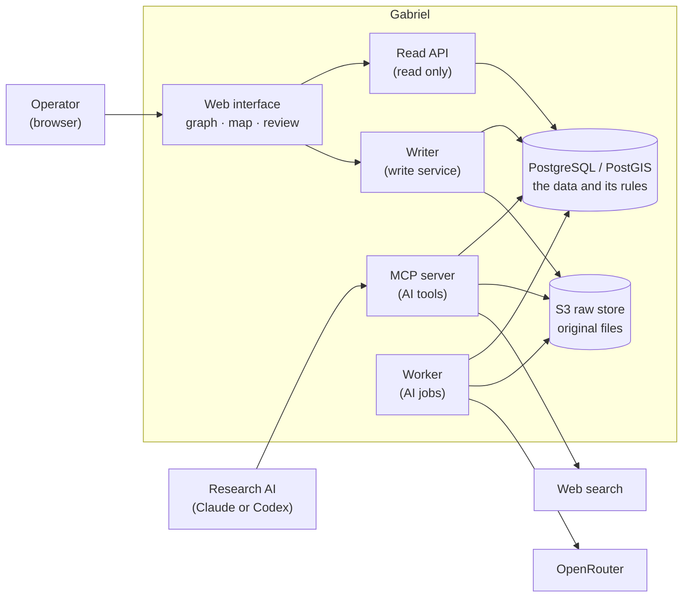

# Gabriel: technical overview

This file tells how the parts connect and which rules hold on every path. Read the code for a table, a type or a
function. The product rules are in `decisions.md`; this file cites them by identifier (M8, P1).

## The parts


```mermaid
flowchart LR
    OP["Operator<br/>(browser)"]
    AI["Research AI<br/>(Claude or Codex)"]

    subgraph APP["Gabriel"]
        UI["Web interface<br/>graph · map · review"]
        READ["Read API<br/>(read only)"]
        WRITE["Writer<br/>(write service)"]
        MCP["MCP server<br/>(AI tools)"]
        WORK["Worker<br/>(AI jobs)"]
        DB[("PostgreSQL / PostGIS<br/>the data and its rules")]
        RAW[("S3 raw store<br/>original files")]
    end

    MODEL["OpenRouter"]
    SEARCH["Web search"]

    OP --> UI
    UI --> READ --> DB
    UI --> WRITE --> DB
    WRITE --> RAW
    AI --> MCP --> DB
    MCP --> RAW
    MCP --> SEARCH
    WORK --> DB
    WORK --> RAW
    WORK --> MODEL
```

| Part | Job |
|---|---|
| PostgreSQL / PostGIS | Holds every record and enforces the rules below. |
| S3 raw store | Keeps each original file unchanged. Any S3 server can hold it. |
| Writer | The only write service of the operator: upload, edit, promote, reject, queue an extraction, start a lead. It also shows the operator the job status of a document and the leads, which the public read never shows. |
| Read API | Read-only HTTP over a fixed set of public views. |
| Web interface | The graph, the map, the review queue, search and the entity pages. |
| Worker | Takes AI jobs from a queue in the database and runs the agents. |
| MCP server | Gives the research AI one flat tool for each action: read the record, the proposals, the documents, the review queue and the leads; search; fetch; propose; queue a job; start a lead; accept or reject a unit or a relation. Each tool says if it reads or writes. |
| OpenRouter, web search | External services. They hold no record of the project. |

## Who can do what

| Actor | Can | Cannot |
|---|---|---|
| Operator | Upload, edit, promote, reject, start a lead. Merge two entities, and undo a merge. | — |
| Research AI | Read the record, the pending proposals and the jobs of a document. Fetch and store documents, propose a change, queue a job, start a lead. Read the review queue and the leads. Accept or reject a unit or a relation, as an AI reviewer. | Decide a unit that its own session proposed (a rule of the skills). Merge. Write a table directly. |
| Worker agents | Read a document, propose a change with the passage that states it. Rate a new author against the reference set. For a lead: search, fetch and store pages, and queue their extraction. | Promote. Merge. Start a lead. Read a lead that they do not run. |
| Public | Read the public views. | Write. |

Each actor has its own database role. The database holds these limits, not the application.

## Rules that hold on every path

The database enforces each rule with a constraint, a trigger, or a permission that the writing
role cannot cross.

1. Every attribute carries at least one source (M8).
2. Every cited source is a stored document (S2).
3. A machine never signs as the operator (M8).
4. No value is null or blank; the unknown is an absent key (M9).
5. Nothing enters the evidentiary layer without a promotion (P1).
6. Each public decision carries its origin (S4).

## The read path

The interface reads through the read API, with a read-only role and a fixed list of views. Complex
reads, such as a graph traversal, run as SQL functions in the database. A timeout, a default limit
and a cache protect the public read. It shows the record and the candidate layer only (PU1): no
rejected proposal, no job, no lead and no model call. A fact about a person (an attribute of a
person, or a relation that names a person) shows only when one of its sources is a public
document, and a person with no public source does not show. A public document is one that anyone
can open at a public address: a web page, a public registry or API, or a file that the operator
uploaded with the address where it comes from. The upload refuses a file with no address, and an
older upload with no address is not public. A new upload of the same bytes gives its address to
such an upload. It never changes an address that is there: it refuses the new upload when the
address is different. An upload stored before this rule is not public, also with an address,
because its address can be the page where the file was bought. A new upload of the same bytes
does not make it public, and the upload refuses it.
A bought file is not public. A file is bought when it has a price or when its provider sells its
filings, because an unknown price is not a free file.
An act about a person also shows only when each person that it names is public. An entity that a
later act retyped stays a person for the older acts about it. The rule covers an entity of the
type person only, and not an entity with no known type. The views of the read API apply this
rule, so a screen cannot skip it. The record keeps the fact, and the machine roles and
the review of the operator still read it. The machine roles read through their own grants.

Each public claim carries its label, in the fixed words of `decisions.md` PU1. An element carries
the label of the act that last set its name and type, and each value carries the label of the act
that last set it. A decider that the label does not know reads as not checked, never as a person.
The database writes the words, so the read API, the screen and an export give the same label. The
public read gets the name and the version of a rule, and never the inputs of the rule (S1). The read API also gives the disclaimer of
the dataset beside the data, and an export file copies it.

A merge keeps the identifier of the entity that it absorbs (M12). The read API gives each
absorbed identifier with the entity that holds it today, so an old link still resolves. The
ledger holds each merge and each undo as an act, with the full copy of what the merge changed.
ADR 0014 gives the rules of a merge and of its undo.

Two vessels with one IMO number are one ship. The number is seven digits, with or without the
prefix "IMO". A new vessel with the number of a vessel in the record or in the queue is a
duplicate that is not clean, and the fault names the other vessel. The review page lists each
pair of vessels of the record with one number. The operator keeps one vessel of a pair: the other
merges into it, and its name becomes a former name.

## The release path

A release is how the data leaves Gabriel. The operator runs one worker command on the PC, with a
release manifest that stays outside the public repository. The command reads the record and writes
one folder, named by the date of the release. It never writes over an earlier folder.

```
the record  →  the release functions of the database (the public rules)
            →  the worker command  →  one dated folder of files, and a manifest of the files
```

- **The read.** The command reads one snapshot of the record, through functions that only the
  roles that run a tool can call. The public read role cannot call them. They apply the rules of the public read (PU1) and
  the rules of a release: each row has at least one public document, and a row names only its
  public documents; a person is in the release only when the record holds a designation of that
  person; a relation is in the release only when its two ends are. The release holds the record
  only, and no candidate.
- **The files.** Each file holds the version, the date and the disclaimer of the dataset, with the
  two contact addresses of the manifest. Each row carries its label in the fixed words of PU1 and
  its licence. A claim is a value of an element or a relation, and each claim names its public
  documents, with the page and the passage that the reader cited. The log of the merges gives
  each merge and each undo, and the entity that each absorbed identifier resolves to. The same
  entities, relations and claims are in three formats: CSV for a spreadsheet, GeoJSON for a map
  tool (the entities with a position), and JSON-LD for linked data. The manifest of the files
  gives the size and the checksum of each file.
- **The changelog.** With the folder of the previous release, the release compares the two
  folders by identifier: each entity, relation and claim added, changed or removed, and each
  entity merged or unmerged. It refuses a previous folder that does not agree with its checksums.
  With no previous folder, the changelog says "first release". ADR 0019 gives the reasons.
- **The licence.** The licence of a row comes from the providers of its public documents. A row
  takes the most permissive one: CC-BY 4.0, CC-BY-NC 4.0, or "derived fact; source under the
  provider licence, not redistributed". A document with no provider gives the last one. The tools
  that store an official list or act give the provider of what they store.
- **The rating.** No file shows a NATO letter or a rating digit (S1). The release manifest holds
  the parameter that would show them, and it is off.
- **The site.** The command also writes a static site beside the folder, from its files only: the
  critical nodes table, a page for each entity and each claim at the path of its identifier, a
  map, the downloads and the method. No page reads an API. ADR 0020 gives the reasons.

ADR 0013 gives the reasons for the format of the folder and for the read.

## The write path

```
a file  →  one ingestion door (P6)
             → raw store (the original file)
             → document record (source, retrieval date)
             → text extraction
             → a job in the queue
                  → text file: the extractor reads the text as it is stored and
                    proposes claims, each with a checked excerpt; a model of
                    another family checks each claim against its passage
                  → structured file: a mapping proposal; after promotion, code loads the rows
every unit      →  the decision rules (S3)  →  accepted, rejected, waits, or the review queue
the queue       →  the operator promotes or rejects (P1)
promotion       →  entities and relations (the evidentiary layer)
```

A promotion is one transaction: it writes the target and marks the proposal accepted. A rejection
writes no target and keeps the proposal as a record. An edit of the operator is a proposal and its
promotion in one transaction, so it is written whole or not at all. A machine role of the back end proposes and never decides. Only the operator, the decision rules in the database and the AI reviewer of the MCP server promote or reject. When an act keeps a
value, the value keeps each document that it already cites.

A machine proposes through one door, which takes a batch. Each act cites a page and a span of
stored text; code finds the span from a quoted excerpt. The door writes the acts and their
citations together, refuses the whole batch on one fault, and returns a pending act that it
already holds instead of a duplicate. The cited passage is private: only the review card of the
operator and the AI reviewer of the MCP server read it.

Before the extractor or the research AI writes its acts, a model of another family checks each act
against its passage. For the research AI, the MCP server asks the checker one time for each batch,
under a hard token cap. The server does not send a batch above the cap. A batch sent again is checked again, at the
cost of one call. A role of its own writes the checks of the research acts. The act is written as
disputed when the check does not support it, or when no cited passage states its value. For the
extractor, a failed check that could not read the act also disputes it. For the research AI, a
checker failure does not dispute the act. Of the verdicts of the checker, only "not supported"
disputes it. An act that no model checked has no check. It waits, and the same batch sent again
checks it.

The flag keeps a short reason, which is frozen with the act. The reason is the value that no
passage states, the verdict and reason of the checker, or that the checker did not answer. The
reason is private: the review card shows it, and the public read does not. After the write, the
record also keeps each verdict with its act. It keeps the checker model, both families and the
reason of the checker, so the rules can decide the unit. The review card says which check ran on
each act: a second model, with its verdict, or code only. An act that the checker did not answer
keeps no check until a later check. A later extraction of the document, or the same batch of the
research AI, gives that check. The first check of an act stays.
Every model call goes to OpenRouter and is recorded.

Before the extractor proposes the batch of a part, code drops each item that a rule can refuse, so
the door and the checker never read it. Code drops a type outside the vocabulary, a group of
countries given as a state body, a concept given as a legal act, and an entity that the job
already proposed and that adds nothing. A later part cannot name a pending proposal by its id.
So code keeps that entity when a kept relation names it or when it adds something. An attribute
or a geometry that the earlier act does not have adds something. When a relation names
it and it adds nothing, code sends the act of the earlier part with the same passages. The door
then returns the act that waits, and the job gives one proposal for the entity. Code drops a person
unless the same batch designates the person, or names the person as a director, an officer or an
owner. Code drops the e-mail address of a person that stays.
A relation that names a dropped item is dropped too. The log keeps the count of drops for each
reason. Each rule decides from the words of the answer alone, so a live run on real documents
measures what it costs in lost facts.

The extractor reads a document in parts. When the door refuses the batch of a part a second time,
the claims of that part are lost. The job keeps the count of refused parts and the first refusal,
and its status shows them to the operator and to the research AI. A job with every part refused
fails, with the same words as its reason. While a job waits or runs, the interface reads its status
again by itself.

Each act gets a unit of decision when the door writes it, and the unit never changes (P11). An
entity is a unit with the relations that depend on it. A relation that names an act that waits in
another group, or names a relation, is a unit of its own, so no entity waits for another group.
The review queue shows one line for each unit. It reads one page of units at a time through the
writer, because the cited passages are private. The AI reviewer of the MCP server reads the same
page through its own role. Each line names who proposed the unit.

A group that other groups wait for comes before them. In a
group, the units with a fault come first, then the clean units in tree order, so a parent comes
before its child. The acts with no group come last. The operator can filter by group, proposer,
fault, source document and name. The database applies the order and the filters, so a page never
needs the whole queue. The filter and the place in the queue stay in the browser, and the selected
unit stays in the address, so a reload keeps all three. A link to a unit opens that unit, also when
it is not on the first page. A link to a unit that waits no more says so and offers no decision.

The acts of one call that name each other are one linked batch: the group of their units. The
group is a label and a filter, and the operator never decides a group as one block. An act that
names no other act of its call stays single, so a faulty claim never blocks a good claim of the
same page.

The operator promotes or rejects one unit. A promotion writes the whole unit in one transaction,
or nothing, and a refusal names the act that the record refused. A relation is written only when
each end is in the record or comes with the same unit, so a unit whose end waits elsewhere is
refused, and the refusal names that end. The rules do not refuse such a unit: it waits until
that end is decided (P11). A rejection keeps one reason from a fixed list, and a
note when the reason is "other". The reason "end rejected" is only for a relation whose other end
was rejected, so it never hides another reason. The reason and the note are private: only the
operator, through the writer, and the AI reviewer of the MCP server read the decided acts with
them. The operator can reject one
relation of a unit alone, and the rest stays one unit. Each decision keeps its mode: one unit, one
relation, or a group action. The page of an entity then names who decided (the operator, a
rule or an AI reviewer) and whether the decision was a group action.

A rail lists the groups that wait, with the counts of their units, of their clean units and of
each fault. The group action promotes the clean units of one group after one confirmation, which
shows the counts and the tree of the clean units. The screen sends the exact units that it showed,
so a unit that came after the view is never written. The database checks the list again, writes
only the units that are still pending and clean, and writes a parent before its child. Each unit
succeeds or fails on its own, and the answer names each unit that failed and why.

One check in the database finds the faults of a list of units. The queue, the promotion and the
group action read this check, so the screen and the record agree. Each fault has one level:

- A fault that blocks stops Promote. The refusal gives the sentence that the screen shows.
- A wait for an entity of the same group stops Promote of that unit alone. The unit stays clean,
  because the group action writes the parent first.
- A fault that is not clean keeps the unit out of a group action. The operator decides it alone.
  An entity whose link to a rejected parent was rejected has no parent now, so it is not clean.
- Information does not change the state of the unit.

A group with a tree is named by the top of its tree. A group with no tree, as the extractor gives,
is named by the document that it cites. The words of a dispute name what the checker found, and
not its codes.

A machine can propose again a claim that the operator rejected, from a new run with new
identities. So each act keeps a frozen key of its claim, with no identity that a run makes: the
type and the name of a new entity; the type and the two ends of a new relation; the target and the
values of any other act. An element that an act proposed gives the key of that act, also after its
promotion. A unit with the key of a rejected act is not clean, and the screen gives the day and
the reason of the newest rejection. An entity matches a rejected entity only under the same
parent, or when both have no parent, so a rejected "1st battalion" marks only a "1st battalion"
under the same parent. The reason stays private to the operator and the AI reviewer of the MCP server.


## The decision path

```
a new author name  →  a model joins it to a known author, or rates it against the
                      reference set  →  a known author, or a letter C to F and a controller
                      when it has one (S1)
a unit, or a new source of a unit
                   →  the rules of S3, in order, from the letters and the checks
                        → impossible     : rejected by the rule
                        → doubt          : the review queue, with the reason
                        → strong sources : accepted by the rule
                        → weak sources   : waits; a deepening search may run (P10)
```

The database applies the rules, so every writer gets the same decision. Each decision records the
name and the version of its rule, "validated manually by the operator", or "decided by an AI
reviewer" (S4), and the inputs that the rule read. Code computes the digit of each fact from its
independent authors and its conflicts, never from the letters (NATO judges the two apart). Only the reference set, which
the operator approves once, holds A and B. The letter of an author records the model, the reason,
and the reference authors that the model compared with. A model never writes a state: the worker
stores the letter that the model gives, and the database decides.

The review queue shows only the units that need the operator by default. The units that wait are a
separate list, with the source that each one needs. The page of an element shows who decided it,
in the label words of `decisions.md` PU1, and the day. A decision of an AI reviewer keeps the
reason that the AI gives.

## The lead path

```
a lead (a short text from the operator or the research AI)
  → a job in the queue, with the text and no document
  → the lead agent: web search, news search, graph search, a search of the stored documents
  → each new page: fetch, store (the ingestion door), queue its extraction
  → the extraction path above proposes the claims
```

A rule of S3 can give a deepening search for a unit with weak sources, inside the budget that the
operator sets. The lead agent proposes nothing, starts no lead, and does not fetch an address that
is already stored. It has no page limit; its token budget stops it. A lead of the operator then
fails with that reason. A deepening search that stops at its budget has ended, and it keeps that
reason for the operator. The rules judge its unit again when the extraction of its pages ends. No schedule starts a lead. The text of a
lead is private: only the operator and the research AI read the leads, and the worker reads the
text of the one lead that it runs.

## Technical baseline

| ID | Decision | Reason |
|---|---|---|
| T1 | TypeScript end to end. | One language and shared types for one operator. |
| T2 | PostgreSQL/PostGIS is the single datastore. | One service for relations, JSON and geometry. |
| T3 | The raw file is in S3, the processed data in PostgreSQL. | The raw file is evidence and stays as it is; the data changes. The store does not lock the raw file: it stays unchanged by convention only. |
| T4 | The interface reads by itself; the backend serves writes only. | A backend that only passes reads on is dead weight. |
| T5 | pgvector and a job table, no vector database and no message queue. | Two fewer services at our volume. |
| T6 | The boundary (Zod) reads the shape of a request. The database holds each rule on data, and words its own refusal. | Each rule has one owner, and the guard holds for any writer. |

The ADRs hold the other build decisions (`README.md`).

## Operational values

Set an operational value (a threshold, a radius, a zoom level) from real data, in configuration.
Never set it as a code constant.
