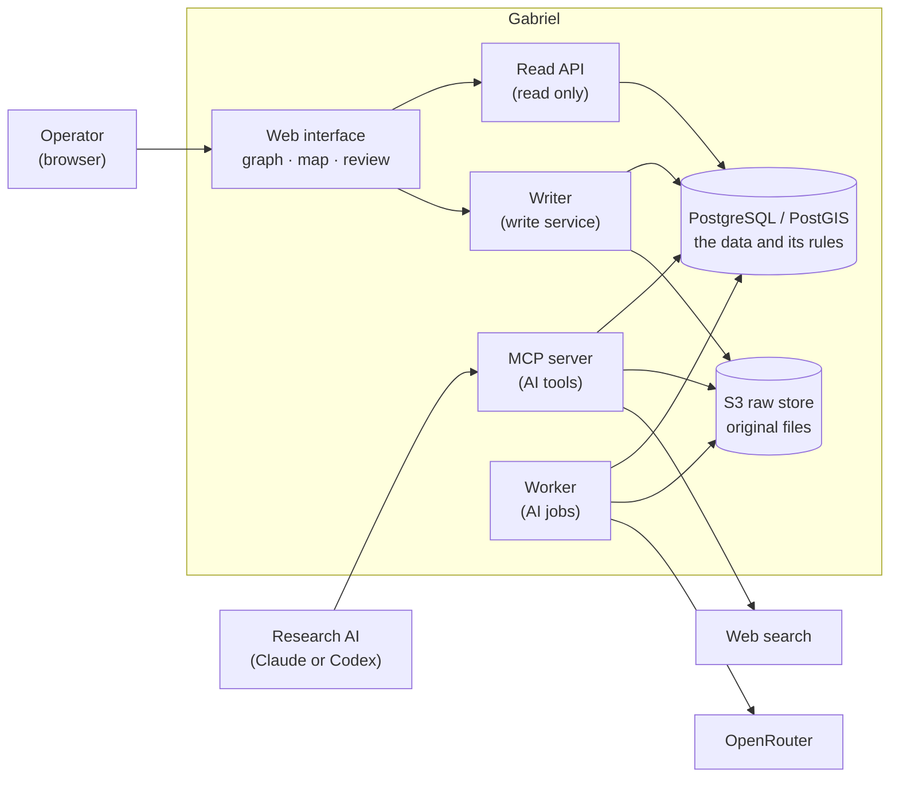

# Gabriel: technical overview

How the parts connect, and which rules hold on every path. Read the code for a table, a type or a
function. The product rules are in `decisions.md`; this file cites them by identifier (M8, P1).

## The parts


```mermaid
flowchart LR
    OP["Operator<br/>(browser)"]
    AI["Research AI<br/>(Claude or Codex)"]

    subgraph APP["Gabriel"]
        UI["Web interface<br/>graph · map · review"]
        READ["Read API<br/>(read only)"]
        WRITE["Writer<br/>(write service)"]
        MCP["MCP server<br/>(AI tools)"]
        WORK["Worker<br/>(AI jobs)"]
        DB[("PostgreSQL / PostGIS<br/>the data and its rules")]
        RAW[("S3 raw store<br/>original files")]
    end

    MODEL["OpenRouter"]
    SEARCH["Web search"]

    OP --> UI
    UI --> READ --> DB
    UI --> WRITE --> DB
    WRITE --> RAW
    AI --> MCP --> DB
    MCP --> RAW
    MCP --> SEARCH
    WORK --> DB
    WORK --> RAW
    WORK --> MODEL
```

| Part | Job |
|---|---|
| PostgreSQL / PostGIS | Holds every record and enforces the rules below. |
| S3 raw store | Keeps each original file unchanged. Any S3 server can hold it. |
| Writer | The only write service of the operator: upload, edit, promote, reject, queue an extraction, start a lead. It also shows the operator the job status of a document and the leads, which the public read never shows. |
| Read API | Read-only HTTP over a fixed set of public views. |
| Web interface | Graph, map, review queue, search and entity pages. |
| Worker | Takes AI jobs from a queue in the database and runs the agents. |
| MCP server | Gives the research AI one flat tool for each action: read the record, the proposals and the documents; search; fetch; propose; queue a job; start a lead. Each tool declares if it reads or writes. |
| OpenRouter, web search | External services. They hold no record of the project. |

## Who can do what

| Actor | Can | Cannot |
|---|---|---|
| Operator | Upload, edit, promote, reject, rate a source, start a lead. | — |
| Research AI | Read the record, the pending proposals and the jobs of a document. Fetch and store documents, propose a change, queue a job, start a lead. | Promote. Read a lead. |
| Worker agents | Read a document, propose a change with the passage that states it. For a lead: search, fetch and store pages, and queue their extraction. | Promote. Start a lead. Read a lead that they do not run. |
| Public | Read the public views. | Write. |

Each actor has its own database role. The database holds these limits, not the application.

## Rules that hold on every path

The database enforces each rule with a constraint, a trigger, or a permission that the writing
role cannot cross.

1. Every attribute carries at least one source (M8).
2. Every cited source is a stored document (S2).
3. A machine never signs as the operator (M8).
4. No value is null or blank; the unknown is an absent key (M9).
5. Nothing enters the evidentiary layer without a promotion (P1).
6. Each public decision carries its origin (S4).

## The read path

The interface reads through the read API, with a read-only role and a fixed list of views. Complex
reads, such as a graph traversal, run as SQL functions in the database. A timeout, a default limit
and a cache protect the public read. It shows the record and the candidate layer only (PU1): no
rejected proposal, no job, no lead and no model call. The machine roles read through their own
grants.

## The write path

```
a file  →  one ingestion door (P6)
             → raw store (the original file)
             → document record (source, retrieval date)
             → text extraction
             → a job in the queue
                  → text file: the extractor reads the text as it is stored and
                    proposes claims, each with a checked excerpt; a model of
                    another family checks each claim against its passage
                  → structured file: a mapping proposal; after promotion, code loads the rows
every proposal  →  review queue and graph marker  →  operator promotes or rejects (P1, S3)
promotion       →  entities and relations (the evidentiary layer)
```

A promotion is one transaction: it writes the target and marks the proposal accepted. A rejection
writes no target and keeps the proposal as a record. An edit of the operator is a proposal and its
promotion in one transaction, so it is written whole or not at all. Only the operator role can
promote: a machine proposes and never decides. When an act keeps a value, the value keeps each
document that it already cites.

A machine proposes through one door, which takes a batch. Each act cites a page and a span of
stored text; code finds the span from a quoted excerpt. The door writes the acts and their
citations together, refuses the whole batch on one fault, and returns a pending act that it
already holds instead of a duplicate. The cited passage is private: only the review card of the
operator shows it.

Before the extractor writes its acts, a model of another family checks each act against its
passage. The act is written as disputed when the check does not support it, when a failed check
could not read it, or when no cited passage states its value. The flag keeps a short reason,
frozen with the act: the value that no passage states, the verdict and reason of the checker, or
that the checker did not answer. The review card shows the reason; the public read does not.
Every model call goes to OpenRouter and is recorded.

The extractor reads a document in parts. When the door refuses the batch of a part a second time,
the claims of that part are lost. The job keeps the count of refused parts and the first refusal,
and its status shows them to the operator and to the research AI. A job with every part refused
fails, with that refusal as its reason. While a job waits or runs, the interface reads its status
again by itself.

The acts of one call that name each other are one linked batch. The review queue shows it as one
card, and the operator promotes or rejects it as one unit, in one transaction. A promotion writes
each entity before the relation that names it. One refused act refuses the whole batch: the
refusal names the act and the reason, and nothing is written. An act that names no other act of
its call stays single, so a faulty claim never blocks a good claim of the same page. The door for
one act refuses an act of a batch, so a batch is never half decided.

## The lead path

```
a lead (a short text from the operator or the research AI)
  → a job in the queue, with the text and no document
  → the lead agent: web search, news search, graph search, a search of the stored documents
  → each new page: fetch, store (the ingestion door), queue its extraction
  → the extraction path above proposes the claims
```

The lead agent proposes nothing, starts no lead, and does not fetch an address that is already
stored. It has no page limit; its token budget stops it, and it gives that reason. No
schedule starts a lead. The text of a lead is private: only the operator reads the leads, and the
worker reads the text of the one lead that it runs.

## Technical baseline

| ID | Decision | Reason |
|---|---|---|
| T1 | TypeScript end to end. | One language and shared types for one operator. |
| T2 | PostgreSQL/PostGIS is the single datastore. | One service for relations, JSON and geometry. |
| T3 | The raw file is in S3, the processed data in PostgreSQL. | The raw file is evidence and stays as it is; the data changes. The store does not lock the raw file: it stays unchanged by convention only. |
| T4 | The interface reads by itself; the backend serves writes only. | A backend that only passes reads on is dead weight. |
| T5 | pgvector and a job table, no vector database and no message queue. | Two fewer services at our volume. |
| T6 | The boundary (Zod) reads the shape of a request. The database holds each rule on data, and words its own refusal. | Each rule has one owner, and the guard holds for any writer. |

The ADRs hold the other build decisions (`README.md`).

## Operational values

Set an operational value (a threshold, a radius, a zoom level) from real data, in configuration.
Never set it as a code constant.
